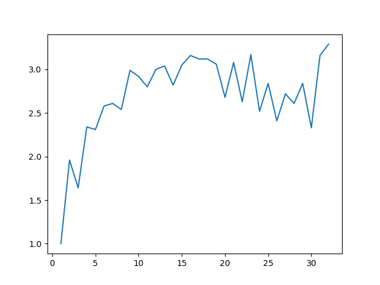
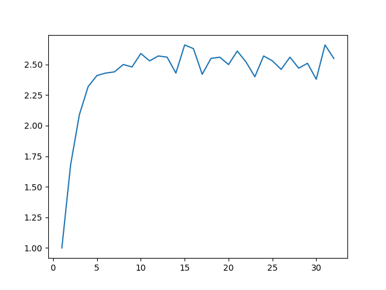
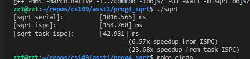
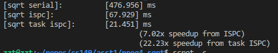
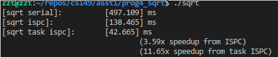
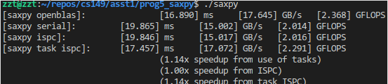

# prog 1

## plot speed up/thread

```sh
./run.sh 1 | ./plot.py
```

## 线程加速比





3线程问题是由于 mandelbort 图像中每个点的迭代次数不一样造成的，也就是说每个点虽然是并行的，但是需要的算力是不一样的，最终时间取决与最后一个thread的计算量:

这点有两个地方可以证明:

1. view 1是对称的，可以看见当我用 2 threads的时候加速比为 1.96x(近似到2了)
2. 3 thread时，中间线程的算量太大，包含了算力最多的部分

## 另外的任务分配方式

可以想办法让每个线程的任务尽量均匀，一种方式是`按照行`分配， 1,2,3,4...交错分配，这能解决3线程问题，3线程在这种分配方式下加速比达到了2.5x,不过仍旧有些不均匀，并且这种方法会带来一个问题，就是cache的使用问题，

# prog2 

采用向量化代码，这里写的是`伪向量化代码`主要为了理解向量化

简单，见code

# prog3

这题是让简单熟悉 `ISPC`

**NOTE** 采用 avx2-i32x16,也就是gang为16的情况会带来6~6.5x加速

有两个关于ISPC的问题我还没研究清楚

- GANG
- TASK 与pthread的不同
- 生成的cpp 向量化代码

# prog4

这个题目与题目1 类似，都是每个data并行，但是每个data所需的算力(迭代次数)不一致

## 最大加速比

按照 算力与data之间的关系，通过排序，让算力相同的尽量8-wide对齐，最终大致能实现 `7x` 的加速比,几乎最大化了

但是这里仍旧有过问题，这样改了之后原来的**线性计算的速度也提升了！** 非常震惊[TO SOLVE]







# prog5

1. 可以观察到加速比仅有 1.0~1.1 左右，几乎与 sequential 一致，
2. 这问题暂时没有解决，不清楚标量乘向量如何实现的 向量化指令(TO SOLVE 需要看ISPC产生的向量化指令汇编代码)
3. 这问题似乎是遭遇了`内存墙`了 暂时不太清楚，

第三个问题，我采用了 `openblas`计算，大致的数据带宽为 17 G/s,在我的计算机(DDR4) 几乎达到最大带宽了，也就是再上升也无法提升计算速度了，[?]


